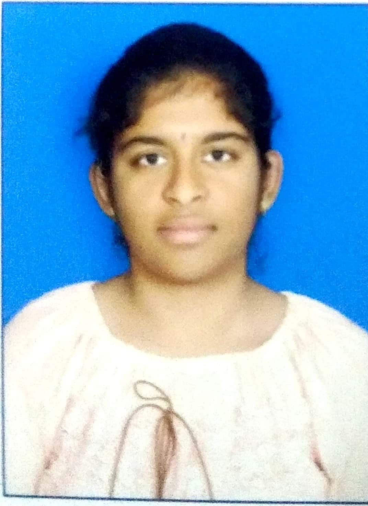

## GADIKOPPULA PRANAVI
+91-9398641856 | pranavigadikoppula@gmail.com

**OBJECTIVE**
       *I am looking  to have an opportunity that stimulates advanced growth and learning in both Academical and Technical skills and my knowledge in Computer Science boosts me in research by adding tangible knowledge in datascience .The immense interest which developed during my bachelor’s  towards analyzing data had made me choose to study further in the field of data science.*

**EDUCATIONAL BACKGROUND**

1.CMR INSTITUTE OF TECHNOILOGY,HYDERABAD(2017-2021)
-Bachelor of Technology in Computer Science and Engineering
            -Cumulative GPA-9.2  
2. SRI CHAITANYA JUNIOR COLLEGE, HYDERABAD (2015-2017)
-Higher Secondary School Certificate (M.P.C)
-Overall percentage-95.7%  
3.KRISHNAVENI HIGH  SCHOOL,MANCHERIAL
Secondary School Certificate
Overall GPA-9.5

**TECHNICAL SKILLS**
        
-Programming Languages- C, PHP, PYTHON, JAVA  
-Data bases-MY SQL  
-Web Technologies-HTML

# PROJECT PROFILES
 ## Mini Project
-Language: c  
-Name: Tic Tac Toess  
-Duration: 15 days  
-Description: tic tac toe is a game . There will be two players and using symbols 0 and *and place them as they wish and the winner will be a person making it aligned horizontally, vertically or diagonally.
## Macro Project
 -Language: python  
  -Name: Driver drowsiness detection system  
 -Duration:30 days  
 -Description: 
Drowsiness detection is a safety technology that can prevent accidents  that are caused by drivers who fell asleep while driving. The objective of this  intermediate python project is to build a drowsiness detection system that will detects  the persons eye and alerts if eyes are closed for a few seconds
## Major Project
  -Language: python  
 -Name: String Similarity Search-A hash Based Approach  
 -Duration:30 days  
 -Description:
String Similarity Search-A hash based Approach is a method which is helpful in dna-      sequencing, error-tolerant query auto-completion  and data cleaning  needed in data base, data Warehouse and data mining.  
**PARTICIPATION**

•	Participated in NSS EVENT  in the colleges  
•	Participated in many Events related to technology  
•	Actively participated in cultural events in school and colleges  
•	Worked as a Volunteer in HEAL ORGANISATION a NGO based organization  
•	Worked as an intern in Whishworks a IT based Company.  

**ACHIEVEMENTS AND CERTIFICATIONS** 
•	   Certificate of participation in Android studio fundamentals Workshop.  
•	   Certifications on participations of NSS cell events.  
•	   Certificate in python for everybody in coursera.  
•	   Scored good marks in JEE MAINS  
•	   Won in many inter school Competitions  

**PERSONAL DETAILS**

●  Date of Birth                : 	   28-02-2000 
●  Father’s Name             :        G. Muralidhar 
●  Mother’s Name           :        G. karuna sree 
●  Current Address  	     :	  h.no-4-120/2, jhanmabhoomi nagar , mancherial 
●  Hobbies              	     :        yoga, drawing , cooking,writing.  
●  Nationality         	     :        Indian  
●  Languages Known       : 	  English, Hindi, Telugu  
●  Any kind of disability  : 	  NO  

